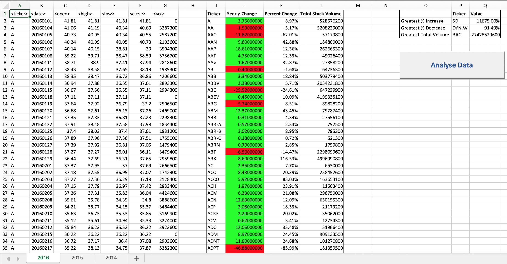
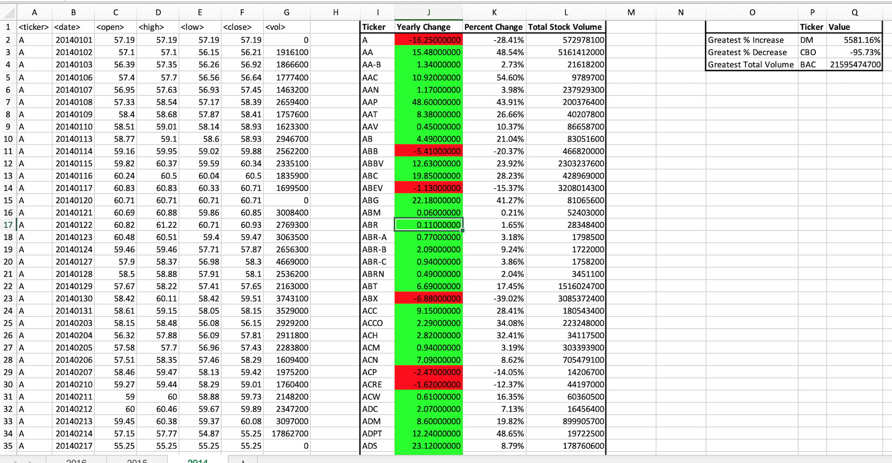

### In the Stock-Market-Analysis project, using VBA:
- the script created will loop through three years of stock data for each run and return the total volume each stock had over these years.

- The ticker symbol displayed coincides with the total stock volume.
- The "Yearly change" is from opening price at the beginning of a given year to the closing price at the end of that year.
- The "Percent change" is from opening price at the beginning of a given year to the closing price at the end of that year.
- The total stock volume of the stock.

- The files also have conditional formatting that will highlight positive change in green and negative change in red.

- That return the stock with the "Greatest % increase", "Greatest % Decrease" and "Greatest total volume".

- Appropriate adjustments have benn made to the script that allows it to run on every worksheet, i.e., every year, just by running it once.

  
  
  

